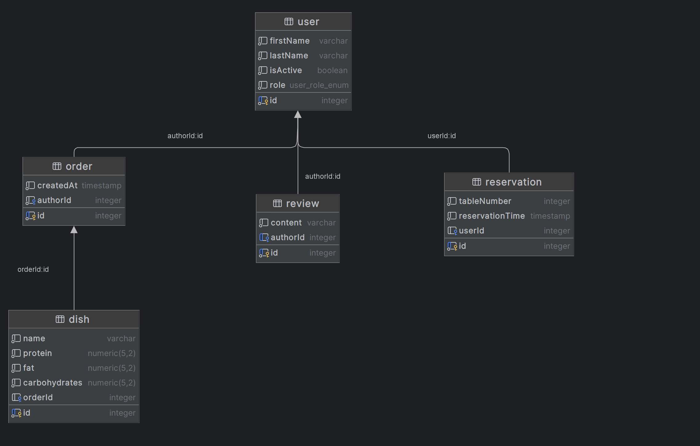

Проект представляет собой сайт ресторана MyRest

### Схема БД

### Описание доменной области и сущностей

Система предназначена для управления рестораном, включая бронирование столиков (reservation), управление меню (dish), заказами (order), отзывами (reviews) клиентов. Системой пользуются пользователи (user). Они имеют разные роли, которые определяют их права в системе.   

- cоздана доменная модель
- разработа RESTful API, подключение Swagger
- написан обработчик запросов GraphQL
- добавлены SSE
- добавлена авторизация через Firebase

